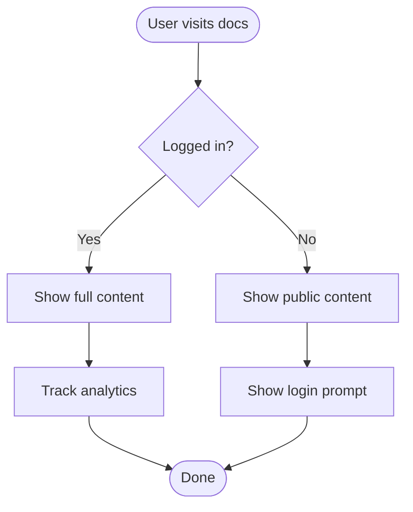
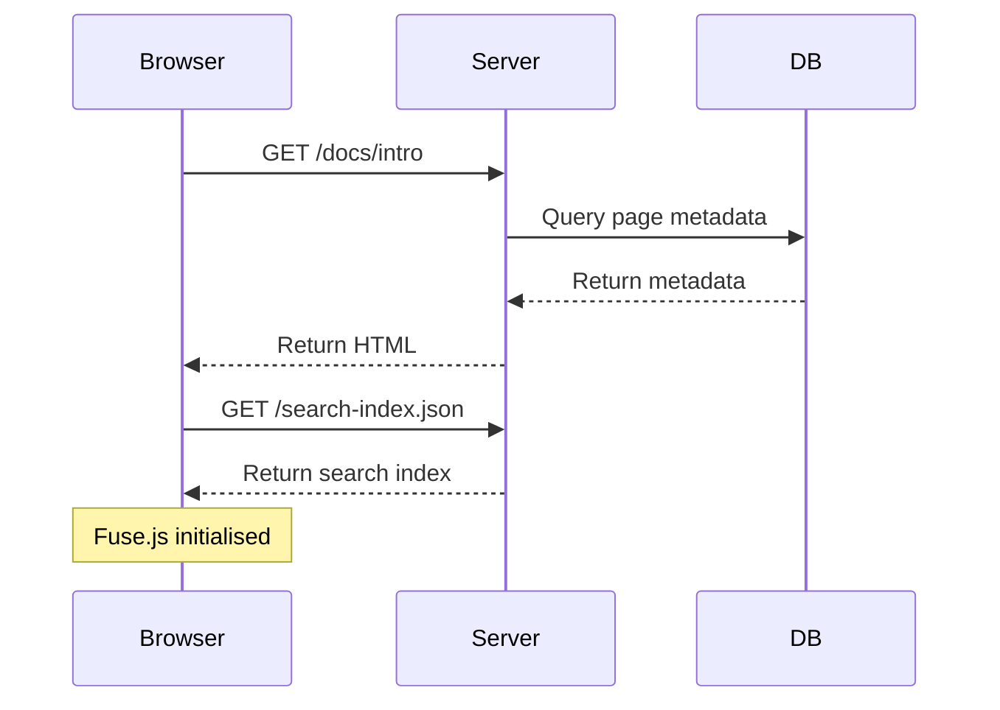
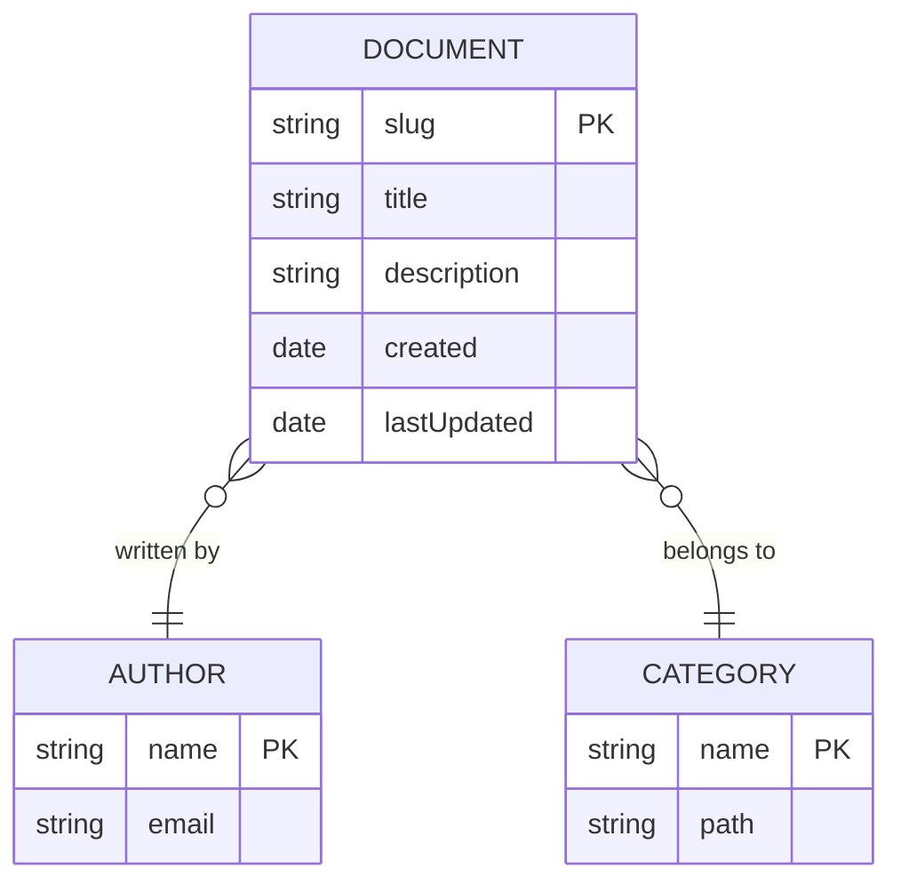
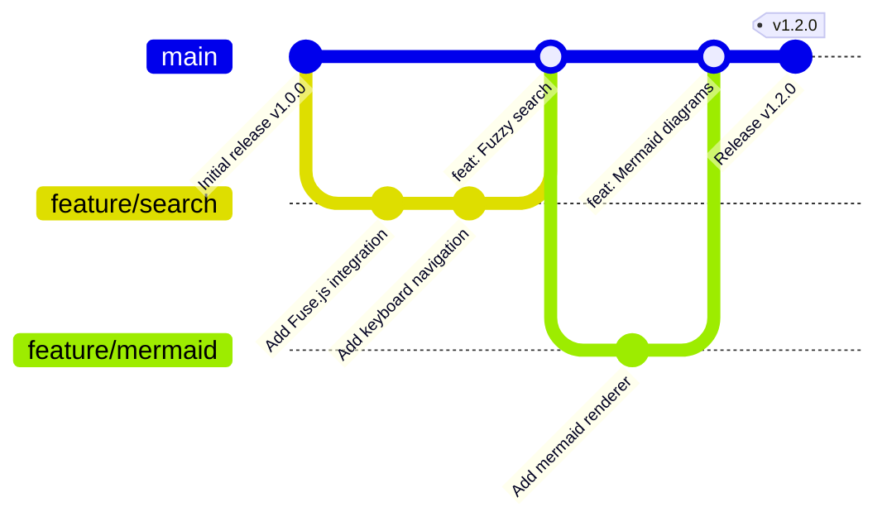
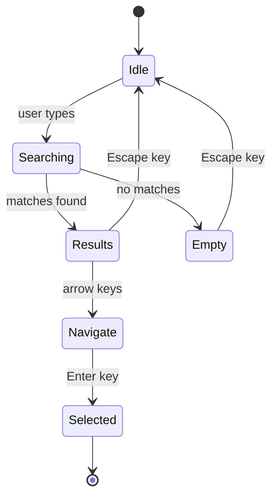
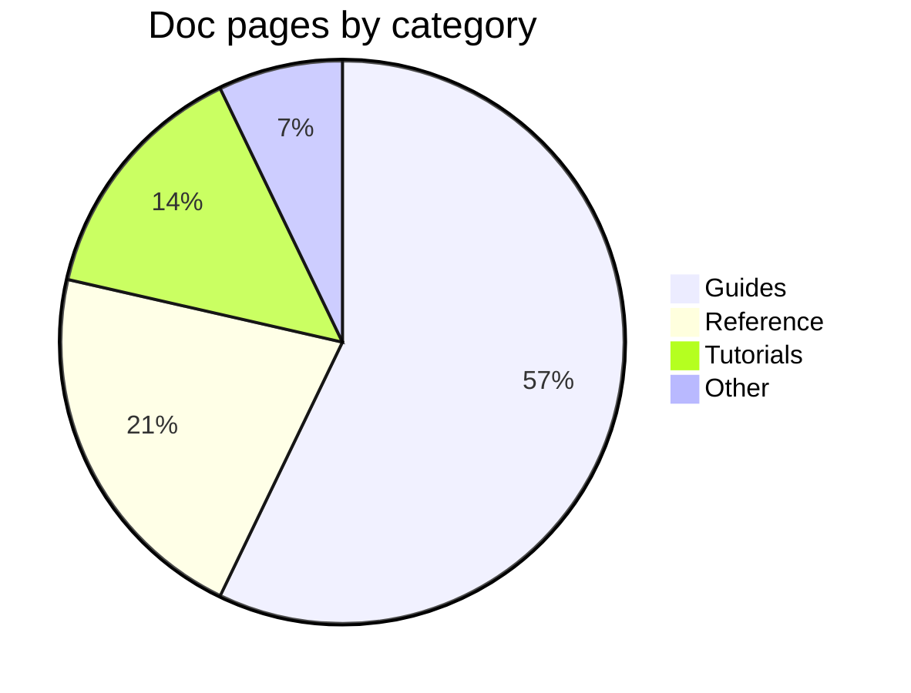
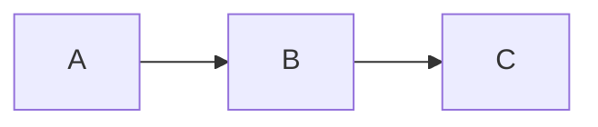

# Mermaid Diagrams

Mermaid lets you write diagrams as code inside fenced code blocks. Use ` ```mermaid ` to render any supported diagram type.

## Flowchart



## Sequence Diagram



## Entity Relationship Diagram



## Git Graph



## State Diagram



## Pie Chart



## Syntax

All diagrams use a fenced code block with `mermaid` as the language:

~~~

~~~

See the [Mermaid documentation](https://mermaid.js.org/intro/) for the full syntax reference.
